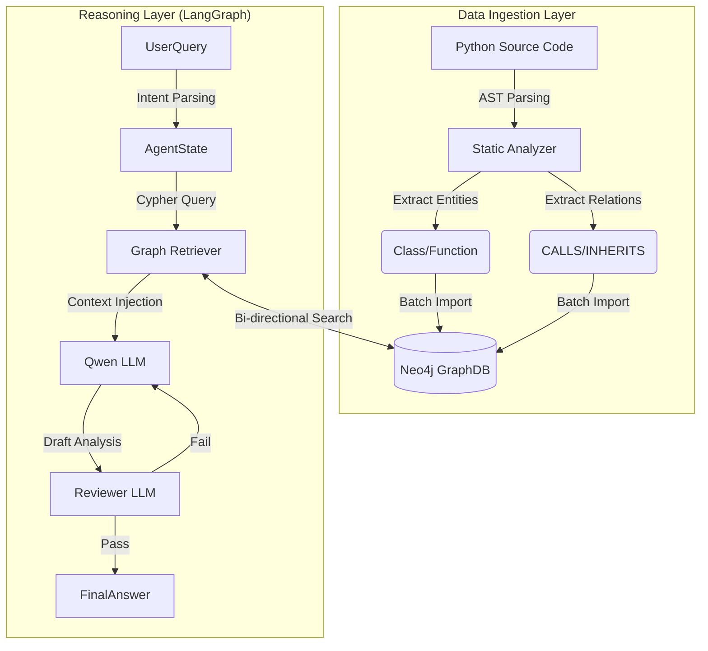

# ✈️ CodeGraph Pilot


> **Structure-Aware Code Intelligence** | 基于静态分析与知识图谱的代码重构助手

CodeGraph Pilot 是一个**面向复杂工程的代码理解与重构辅助系统**。它旨在解决传统 RAG（检索增强生成）在代码领域中“语义漂移”与“结构缺失”的问题。通过将源代码转化为 **Code Property Graph (代码属性图)** 并存入 Neo4j，结合 LLM 的推理能力，实现对代码修改影响范围的 **确定性 (Deterministic) 分析**。

## 💥 痛点与解决方案

在大型遗留系统（Legacy System）的维护中，开发者常面临以下挑战：
*   **依赖黑盒**：修改一个底层函数，不知道哪些上层业务会崩溃。
*   **RAG 幻觉**：基于向量相似度的检索往往只能找到“名字像”的代码，而忽略了“逻辑上调用”的代码。

**本项目的解决方案：**
*   **混合检索架构 (GraphRAG)**：`AST 拓扑结构` (精确召回) + `Vector 语义理解` (模糊召回)。
*   **自反思 Agent**：引入 `Critic` 角色构建循环工作流，对 LLM 的分析结果进行二次校验。

## 🛠️ 系统架构 (Architecture)



## ✨ 核心特性

### 1. 确定性静态分析 (Deterministic Static Analysis)
不依赖 LLM 进行不稳定的结构提取，而是自主研发基于 `ast.NodeVisitor` 的解析引擎。
*   **多粒度解析**：支持 `Class`, `Method`, `Function` 及其层级关系。
*   **精确调用链**：能够识别 `self.method()` 类内调用及跨文件引用。

### 2. 双向影响范围追踪 (Bi-directional Impact Analysis)
在 Neo4j 中实现了定制化的 Cypher 查询模板，支持：
*   **Outbound (依赖分析)**：该函数调用了哪些底层服务？
*   **Inbound (影响分析)**：哪些上层业务依赖该函数？（重构高危区）

### 3. 自修正 Agent 工作流 (Self-Correcting Workflow)
基于 **LangGraph** 构建的状态机包含 `Parse -> Retrieve -> Generate -> Review` 四个阶段。
*   **Loop 机制**：若 `Reviewer` 发现分析结果与图谱事实不符，会自动触发回退重生成机制，有效降低幻觉率。

## 📂 项目结构

```text
code-graph-pilot/
├── src/
│   ├── agent.py          # LangGraph 状态机与工作流编排
│   ├── graph_builder.py  # AST 解析器与 Neo4j 数据加载器
│   ├── app.py            # Streamlit 前端交互与可视化逻辑
│   └── utils.py          # 辅助工具函数
├── docker-compose.yml    # Neo4j 数据库容器配置
├── pyproject.toml        # uv 依赖管理
├── .env.example          # 环境变量示例
└── README.md             # 项目文档
```

## ⚡️ 快速开始 (Quick Start)

### 前置要求
*   Python 3.10+
*   Docker & Docker Compose
*   [uv](https://github.com/astral-sh/uv) (推荐) 或 pip

### 1. 启动基础设施
项目依赖 Neo4j 存储图谱数据，使用 Docker 一键启动：
```bash
docker-compose up -d
# 等待约 20秒，访问 http://localhost:7474 确保 Neo4j 已就绪
# 默认账号/密码: neo4j / password123
```

### 2. 安装依赖
```bash
# 克隆仓库
git clone https://github.com/kuangxiaoc/code-graph-pilot.git
cd code-graph-pilot

# 使用 uv 同步环境 (速度极快)
uv sync
```

### 3. 配置环境
复制配置文件并填入你的 API Key：
```bash
cp .env.example .env
```
在 `.env` 中填入：
```ini
NEO4J_URI=bolt://localhost:7687
NEO4J_USER=neo4j
NEO4J_PASSWORD=password123
QWEN_API_KEY=sk-xxxxxxxxxxxxxx
QWEN_BASE_URL=https://dashscope.aliyuncs.com/compatible-mode/v1
```

### 4. 运行系统
```bash
uv run streamlit run src/app.py
```

## 📸 演示截图

| 批量入库与图谱构建 | 深度依赖分析与中文报告 |
|:---:|:---:|
|  |  |
| *支持多文件批量上传与实时物理引擎渲染* | *Qwen-Plus 生成的结构化风险评估* |

## 🗺️ Roadmap

- [x] 基于 AST 的 Python 代码静态分析
- [x] Neo4j 图谱构建与可视化
- [x] LangGraph 循环 Agent 工作流
- [ ] 支持 Java/Go 语言解析 (计划引入 Tree-sitter)
- [ ] 集成 Vector DB 实现完整的 GraphRAG 混合检索
- [ ] IDE 插件化 (VS Code Extension)

## 📄 License

[MIT](LICENSE)

---